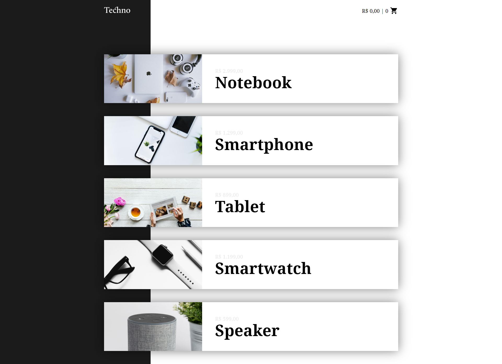
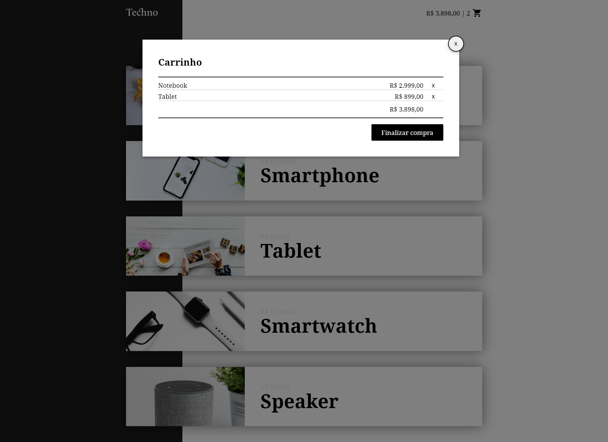
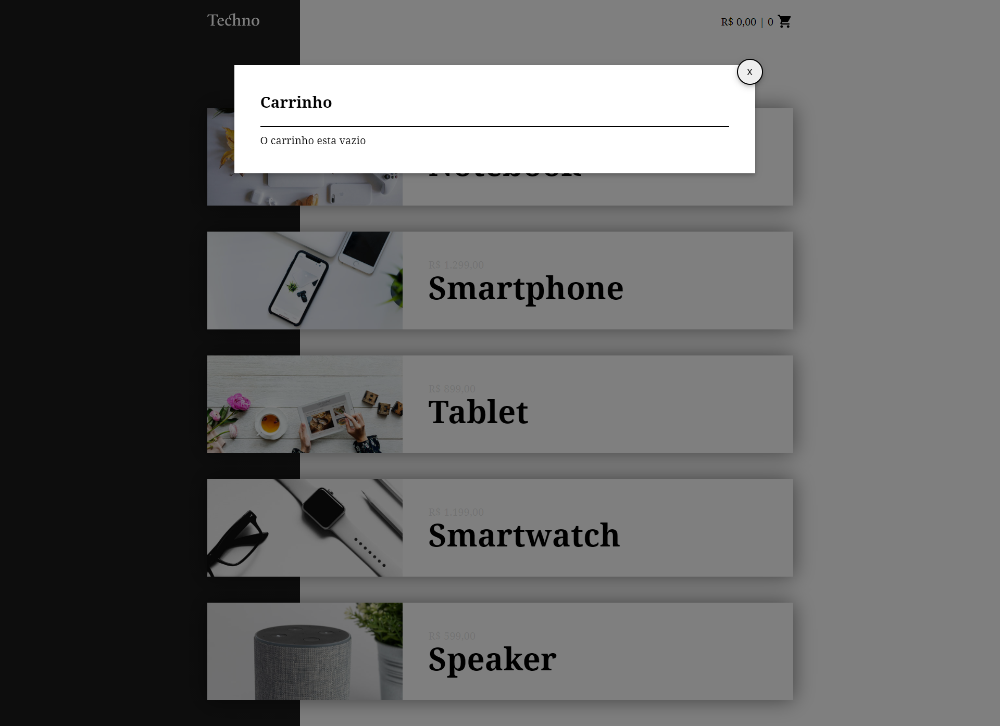
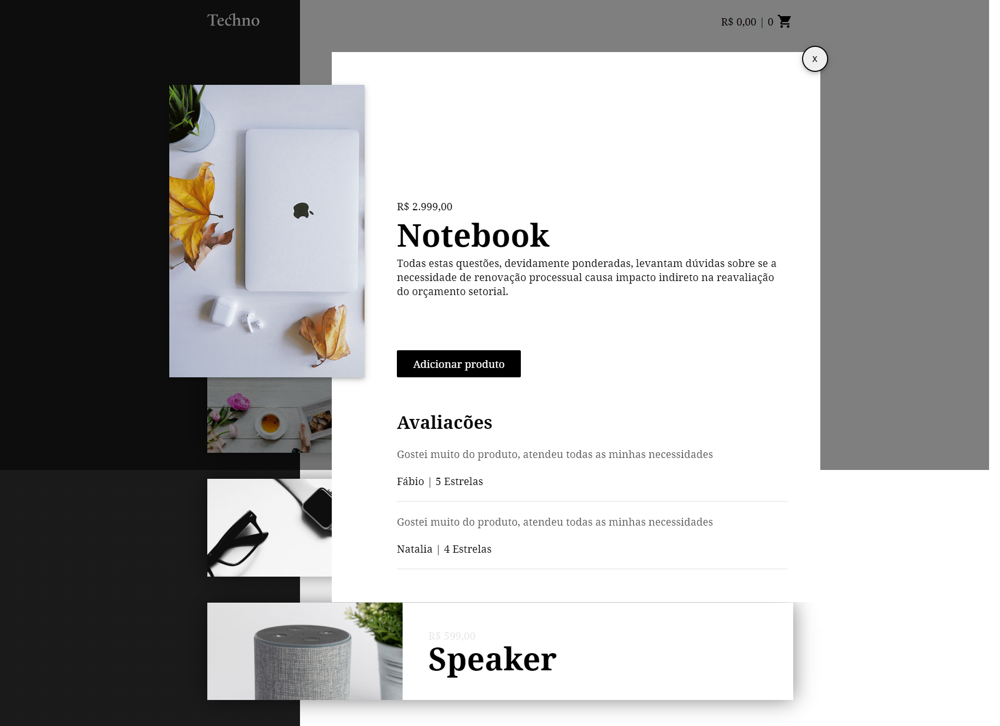

<h1 align="center">Tecno</h1>
_Status: Completo_

## Descrição

Projeto desenvolvido para fins educacionais, afim de consolidar todo o conteudo absorvido durante os estudos com mini-cursos, blogs, publicações, documentações e livros.

## Sobre

Parte de um front-end de um sistema de venda de produtos

### Instalação

```
npm install
```

### Compilação

```
Live server
```

### Recursos

- [x] Adicionar no carrinho
- [x] Remover do carrinho
- [x] Finalizar compra
- [x] Apresentar totalizadores

### Tecnologias

- vue.js
- javascript
- HTML
- Css

### Projeto

<table>
<tr>
<td></td>
<td></td>  
<tr>
<td></td>
<td></td>  
<tr>
</table>

### Contribuição

- Felicio F. M. Neto
